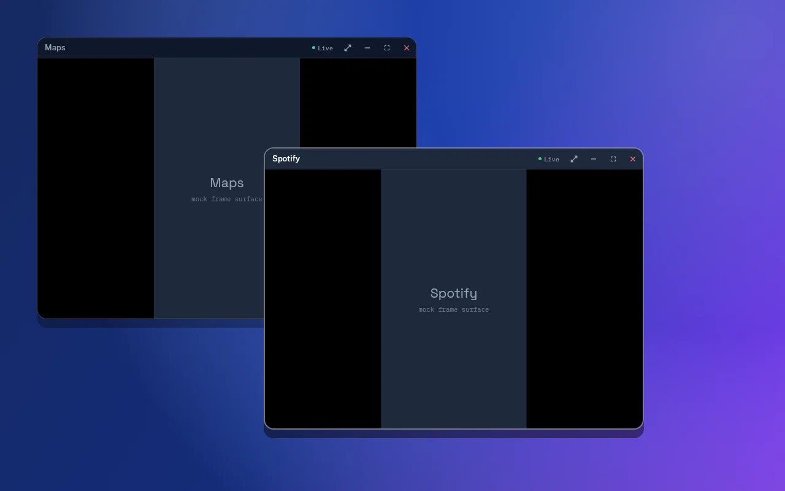

# DroidPier

**Your Android. A bigger workspace.**

DroidPier brings your Android apps into a desktop workspace: launch apps, arrange
multiple windows, use your keyboard and mouse, and manage your connected phone.
Your apps run on your phone. Your computer provides the workspace.

*Actual Flutter UI rendered with synthetic demo data; this preview is not a device compatibility test.*

[Website](https://gysosin.github.io/droidpier/) · [Documentation](docs/README.md) · [Wiki](https://github.com/gysosin/droidpier/wiki)

[Run Android apps on Linux](https://gysosin.github.io/droidpier/android-apps-on-linux/) ·
[Samsung DeX alternative for Linux guide](https://gysosin.github.io/droidpier/samsung-dex-alternative-linux/)

## Download

**0.1.0-beta.2 is an experimental Linux/Android preview.** These downloads are for
early testing. USB and direct-stream window workflows were exercised on one Android 13 phone;
wireless pairing and the full Linux desktop/distribution matrix remain unverified. Read the release notes before installing; package
availability is not a support guarantee. Windows and macOS remain in development.

[Download published releases](https://github.com/gysosin/droidpier/releases)

| Platform | Package | Status |
| --- | --- | --- |
| Ubuntu / Debian / Linux Mint, x86-64 | [DEB](https://github.com/gysosin/droidpier/releases/download/v0.1.0-beta.2/droidpier-0.1.0-beta.2-linux-amd64.deb) | Experimental; Mint untested |
| Fedora, x86-64 | [RPM](https://github.com/gysosin/droidpier/releases/download/v0.1.0-beta.2/droidpier-0.1.0-beta.2-linux-x86_64.rpm) | Experimental |
| Other compatible Linux desktops, x86-64 | [AppImage](https://github.com/gysosin/droidpier/releases/download/v0.1.0-beta.2/droidpier-0.1.0-beta.2-linux-x86_64.AppImage) / [archive](https://github.com/gysosin/droidpier/releases/download/v0.1.0-beta.2/droidpier-0.1.0-beta.2-linux-x86_64.tar.gz) | Experimental; see minimum requirements |
| Android | [Companion APK](https://github.com/gysosin/droidpier/releases/download/v0.1.0-beta.2/droidpier-companion-0.1.0-beta.2.apk) | Experimental; Android 15 emulator tested |
| Windows x64 | Installer / portable ZIP | In development |
| macOS Apple Silicon / Intel | Separate DMGs | In development |

Published desktop packages include the matching companion APK, shell agent, ADB,
scrcpy, and video decoder. End users do not need a development SDK. DroidPier uses
FFmpeg under LGPL-2.1-or-later; matching dependency source archives accompany binary
releases. [Licenses and source details](docs/THIRD_PARTY.md)

## What it does

- A desktop workspace with an app drawer and multiple embedded Android app windows.
- Move, resize, minimize, maximize, and close app windows.
- Keyboard and pointer input, including Android navigation actions.
- USB connections and Android wireless-debugging pairing.
- Optional clipboard synchronization and notification integration.
- Phone battery information, volume controls, and supported media actions.

**Known limits:** audio is not forwarded to computer speakers; media controls do
not imply audio playback. DRM-protected and secondary-display-restricted apps may
not work. Android behavior varies by device, OS version, and manufacturer.
60 FPS is not restored: the direct Linux pipeline measured roughly 39–47 displayed
FPS on the tested computer/phone. Results vary with workload and hardware. See [compatibility](docs/COMPATIBILITY.md).

## First connection

1. Install the appropriate published desktop package and open DroidPier.
2. On the phone, enable **Developer options → USB debugging**.
3. Connect a USB data cable. Unlock the phone and approve the computer's debugging
   authorization prompt only if you trust that computer.
4. Select the phone in DroidPier. The desktop installs its bundled companion.
5. Open **DroidPier Companion** on Android for setup/status. Notification access
   is optional and must be granted explicitly in Android settings.
6. Open an app from the desktop app drawer.

For wireless use on Android 11 or later, enable **Wireless debugging** while both
devices are on a trusted network. Use **Nearby**, scan the computer's **QR code**
from the phone, or choose **Manual** pairing. Pairing and connection ports differ.
Discovery cannot find phones on isolated or multicast-blocked networks, and does
not authenticate them automatically. Do not expose ADB to the public internet. [Detailed setup and troubleshooting](docs/USER_GUIDE.md)

## Privacy and security

No DroidPier account, cloud relay, advertising, or analytics is required. Device
communication is authenticated and carried through ADB. Clipboard and notification
features expose that content to your connected computer when enabled; use them
only with trusted devices. [Privacy](docs/PRIVACY.md) · [Report a vulnerability](SECURITY.md)

## Build and contribute

[Development guide](docs/DEVELOPMENT.md) · [Architecture](docs/ARCHITECTURE.md) ·
[Contributing](CONTRIBUTING.md) · [Roadmap](docs/ROADMAP.md) · [Changelog](CHANGELOG.md)

Bug reports should describe your platform, app version, Android version, and
reproduction steps. Remove device identifiers, pairing codes, personal notifications,
clipboard text, and secrets from screenshots and logs.

## Star history

[View DroidPier's star history](https://github.com/gysosin/droidpier/tree/metrics)

The repository records daily aggregate star counts, never individual profiles.
Zero stars is a valid starting point; API failures preserve the previous chart.

## Credits and license

Original DroidPier code is licensed under [Apache-2.0](LICENSE). Bundled components
retain their own licenses; see [NOTICE](NOTICE) and [third-party notices](docs/THIRD_PARTY.md).
DroidPier builds on Flutter, Android tooling, and scrcpy. It is independent of and
not endorsed by Google, Samsung, Genymobile, or their affiliated products.
